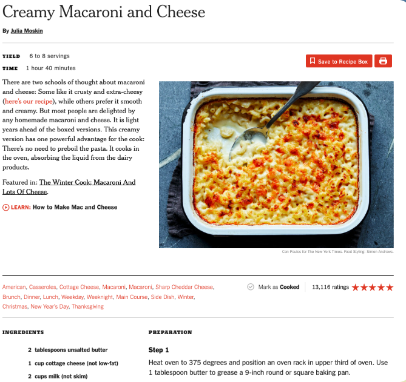
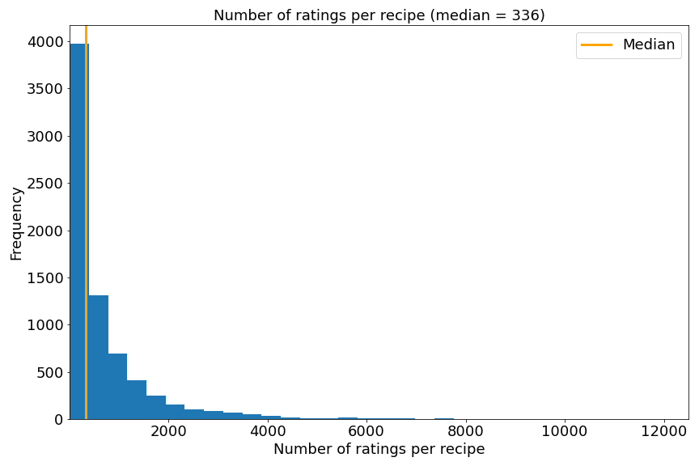
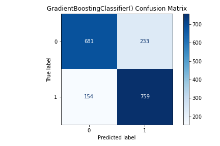
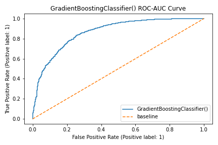
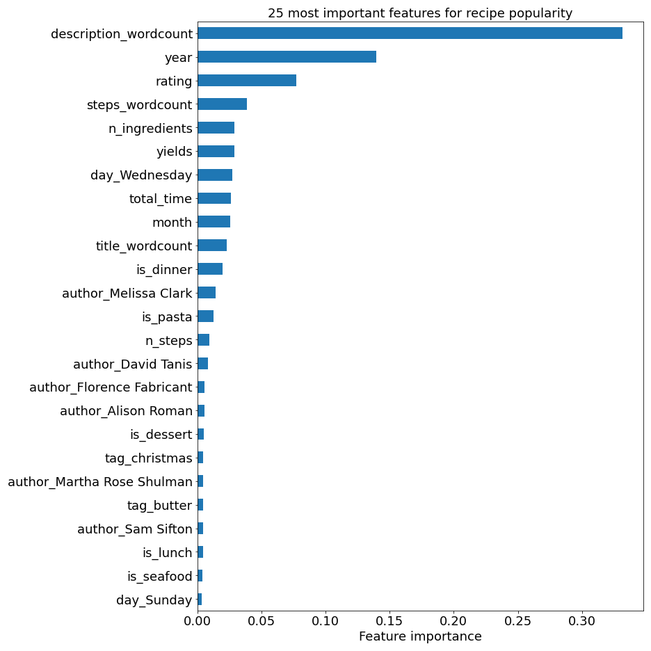
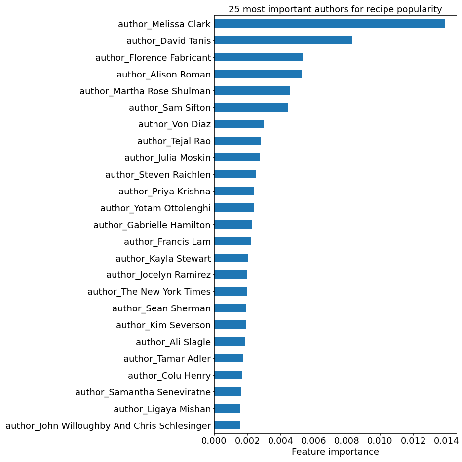
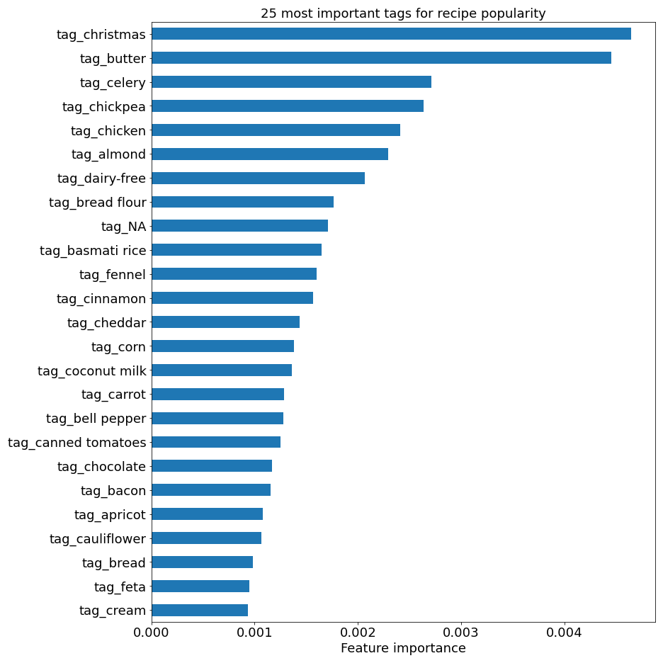

# Predicting New York Times Cooking Recipe Popularity¶
_Author: Joe Serigano (jserigano4@gmail.com)_
---
---
## Contents:
- [Introduction and Problem Statement](#Introduction-and-Problem-Statement)
- [Data Collection and Description](#Data-Description)
- [Executive Summary](#Executive-Summary)
- [Conclusions and Recommendations](#Conclusions-and-Recommendations)

## Introduction and Problem Statement

[NYT Cooking](https://cooking.nytimes.com/) is a subscription service and digital source for 20,000+ recipes from The New York Times. The site also includes how-to guides for home cooks of every level, weekly cooking newsletters, and recipe suggestions. Subscribers also have access to a recipe box where they can store their favorite recipes for future use. 

Recipes on the site, such as the Creamy Macaroni and Cheese example below, include many common recipe features as well as links to related content and keywords that lead one to similar recipes. The website also has a 5 star rating system and the ability for users to leave comments related to their experience with the recipes.

In the digital age, online traffic and engagement are huge metrics of success for a website. This can be monitored in a number of different ways, including via total number of recipe ratings. Since NYT Cooking is a paid subscription service, the retention of existing, loyal subscribers and acquisition of new subscribers is key.
This can only be accomplished by creating engaging content for users.

In order for NYT Cooking to continue their growing platform and ongoing success, they must maintain and increase overall site traffic and continue to attract new users. **The goal of this project is to:**
- **Determine how NYT Cooking can improve their recipe popularity and overall site traffic through web scraping of open access recipe data.**
- **Determine what characteristics of a recipe are most likely to increase the overall popularity, and thus lead to higher site traffic.**
- **Recommend changes that can be made to a recipe before posting.**

In order to answer these questions, we'll build a classification model to predict whether a recipe will create higher than average site traffic based on several recipe features. We will use number of ratings as a proxy for popularity and site traffic.

## Data Collection and Description

After generating 10,000 NYT Cooking URLs using an [XML Sitemap creator](https://www.xml-sitemaps.com/), recipe data was collected using the [recipe_scrapers](https://github.com/hhursev/recipe-scrapers) web scraping tool found on Github from user [hhursev](https://github.com/hhursev). After data cleaning, which mostly included removing URLS that were not recipes, 7,627 recipes were left for analysis. The data collected from each recipes and used in the classification model includes:
- Title of recipe
- Author of recipe
- Date of posting
- Recipe description
- Total time for recipe
- Recipe yield
- Number of steps
- Text for all steps
- Number of ingredients
- Text for all ingredients
- Number of ratings for recipe
- Recipe tags (keywords for main ingredients in each recipe)
- Cuisine type
- Recipe categories (e.g., breakfast, lunch, dinner)
- Recipe ratings

## Executive Summary

The features listed above were used to predict whether a recipe would be more popular, and thus produce more site traffic, than other recipes. A popular recipe is defined as a recipe with a rating count greater than the median number of ratings. Median was used in this case, as opposed to mean, because there are clearly outliers in our data and the target variable of number of ratings is heavily skewed. Outliers in this case are important, so we don't want to get rid of them.

The goal is to build a classification model to accurately predict whether or not a recipe is considered highly trafficked, and from this determine which features are the most important to recipe popularity. In total, 109 tags were used as features in our model. These included all tags that appeared in more than 15 recipes. Categorical features such as *breakfast*, *lunch*, *dinner*, *quick*, *easy*, etc. were also used as one-hot encoded model features.

Multiple classification models were developed with hyperparameter tuning in order to determine which classifier produced the most accurate model predictions. The classifiers included:

- LogisticRegression()
- KNeighborsClassifier()
- RandomForestClassifier()
- AdaBoostClassifier()
- GradientBoostingClassifier()
- XGBoost

A stacked model of the best performing models was also created. In the end, the best performing model was the GradientBoostingClassifier() which achieved an accuracy of 0.79 and a test data set ROC-AUC score of 0.86.

## Conclusions and Recommendations

According to the best-performing model, the top 25 most important features are listed below:

- Wordier recipes tend to have more reviews and be more popular, perhaps because they include more information and lead to better results.
- Comfort foods such as desserts and pasta perform better than others.
- Posting a recipe on Wednesday leads to more online interaction.
- Melissa Clark, David Tanis, and Alison Roman publish the most popular recipes.

Looking at authors alone, the top 25 performing authors are:

Looking at tags alone, the top 25 performing tags are:

It's clear that users enjoy christmas recipes, which isn't a surprise since NYT Cooking is known for their christmas cookie recipes. Recipes including butter, chickpeas, almonds, and chicken produce a lot of site traffic as well. On the other hand, dairy-free recipes or recipes including celery, cinnamon, and fennel have a negative correlation to rating count and do not typically perform well.
